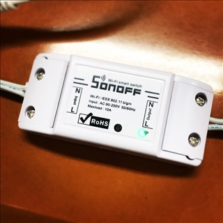
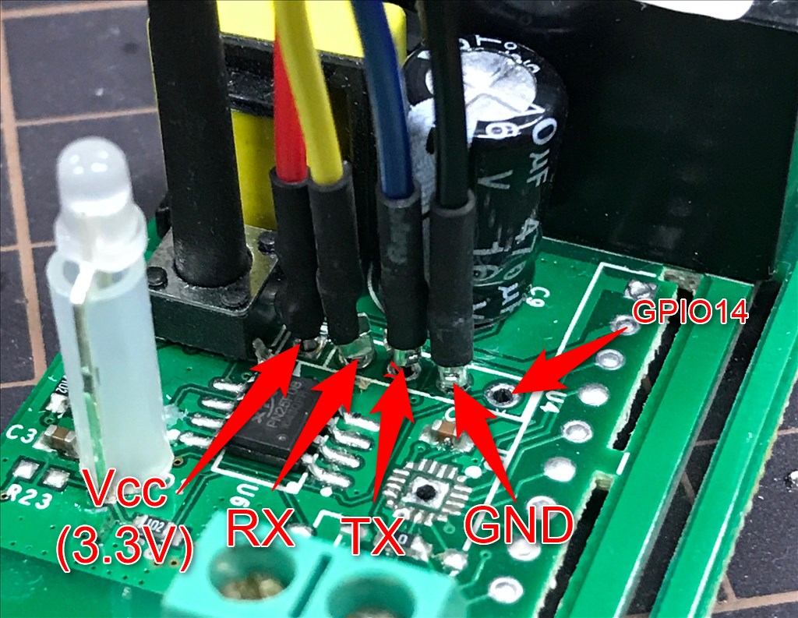

mqtt-sonoff.ino
====
a relay control sample sketch using MQTT.

SONOFF
* https://www.itead.cc/sonoff-wifi-wireless-switch-1.html

pubsubclient
* https://github.com/knolleary/pubsubclient/

How to use:
----

    $ git clone https://github.com/yoggy/mqtt-sonoff
    $ cd mqtt-sonoff
    $ cp config.ino.sample config.ino
    $ vi config.ino
      - edit wifi_ssid, wifi_password, mqtt_server, mqtt_subscribe_topic, ... etc
    $ open mqtt-sonoff.ino

Arduino settings;
  * Board: Generic ESP8266 Module
  * Flash Mode: DIO
  * Flash Frequency: 40MHz
  * Upload Using: Serial
  * CPU Frequency: 80MHz
  * Flash Size: 1M (64K SPIFFS)
  * Debug Port: Disabled
  * Debug Level: None
  * Reset Method: ck
  * Upload Speed: 115200

Reference
----

* SONOFF - ESP8266 Update Firmware With Arduino IDE
  * https://www.hackster.io/adachsoft_com/sonoff-esp8266-update-firmware-with-arduino-ide-7f6ad6

* GPIO Locations · arendst/Sonoff-Tasmota Wiki · GitHub
  * https://github.com/arendst/Sonoff-Tasmota/wiki/GPIO-Locations

* Sonoff_TH_Schematic.pdf
  * https://www.itead.cc/wiki/File:Sonoff_TH_Schematic.pdf

Copyright and license
----
Copyright (c) 2017 yoggy

Released under the [MIT license](LICENSE)
